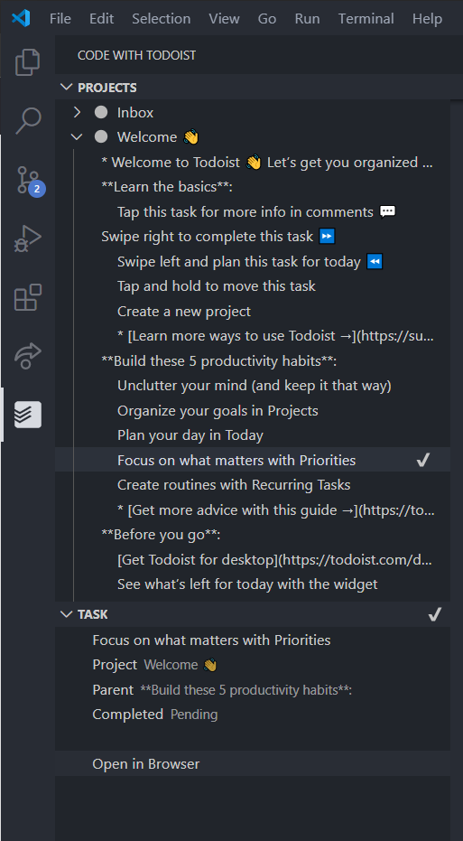

# code-with-todoist

This extension provides some of the [Todoist](https://todoist.com/) features on vscode.

This extension is still in preview.

## Configuration

To access your Todoist tasks, you will need to add your Todoist API token. 

You can get at your API token at [here](https://todoist.com/prefs/integrations)

Set the API token under File > Preferences > Settings > Code With Todoist > Todoist Integrations API token

## Features

* View projects
* View tasks
* Mark task as done

## TODO

* Parse //TODO in code and import to Todoist
* Inline show the imported todos

**Enjoy!**
