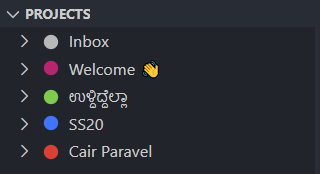
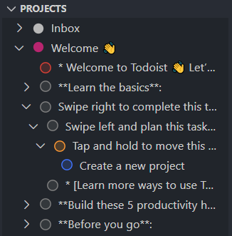
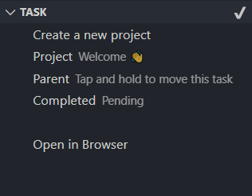
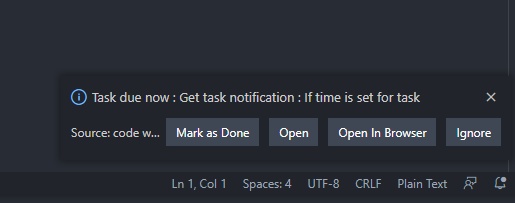
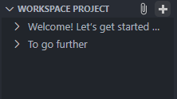
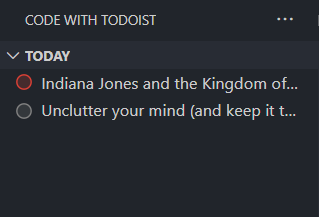
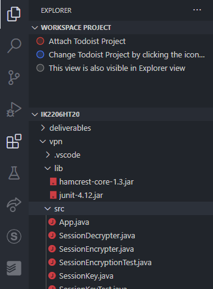

# code-with-todoist

This extension allows you to track your [Todoist](https://todoist.com/) tasks from [vscode](https://code.visualstudio.com/).

## Configuration

### Todoist API Token

Before you can use the extension, you must set up your Todoist API token. To do this, you can follow the steps below.

1. Get your API token [here](https://todoist.com/prefs/integrations).
2. Run the `Todoist: Set API Token` command from the command palette.

### Additional Settings

There are a few settings that can be configured in the extension settings. You can access the extension settings by going to

> File > Preferences > Settings > Code With Todoist

`showTaskNotifications` - Enabling this shows notifications for tasks which have a due time.

`showTodaysTasks` - Enabling this shows today's tasks at the top of the extension sidebar view.

`sortBy` - Choose how the Todoist tasks should be sorted in the task views. The two options are to

1. Retain Todoist task ordering
2. Sort based on task priority

`syncInternval` - Value in milliseconds at which interval Todoist data is synced.

## Features

### View projects with colour coding

### View tasks and subtasks under each project and section with its priority

1. Tasks with Priority 1 have red circle before them.
2. Tasks with Priority 2 have orange circle before them.
3. Tasks with Priority 3 have blue circle before them.
4. Tasks with Priority 4 (default) have grey circle before them.

### View Task details and mark it as done

### Get Task Due Notifications when setting is enabled

### Create new Task

New Task is associated with the selected worksapce project. If no workspace project is set, it is associated with `Inbox` project.

### Show today's tasks

### Attach Todoist projects to vscode workspaces

### Offline Support

All Todoist data is cached locally and can be viewed without Internet access.

Todoist Data is synced every 10 minutes by default, but this can be overriden in the Extension Settings.

## Known issues

* Markdown support in Task names - Unsure if vscode extension API supports this.
